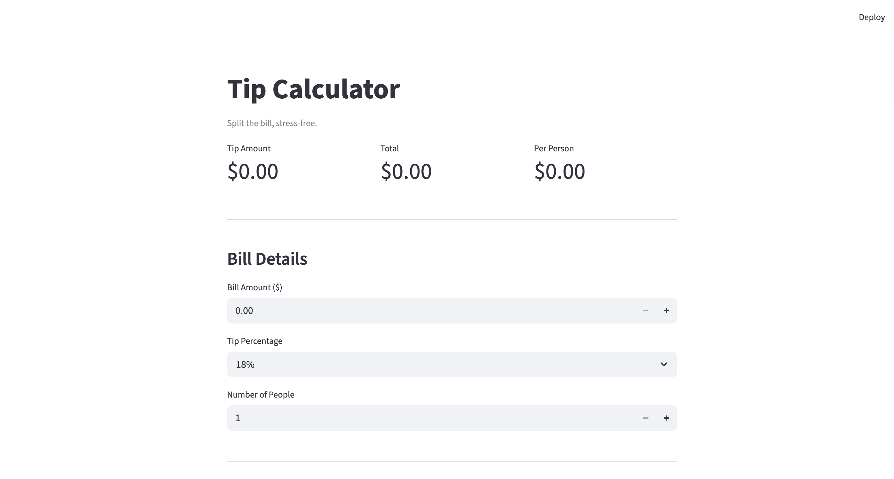
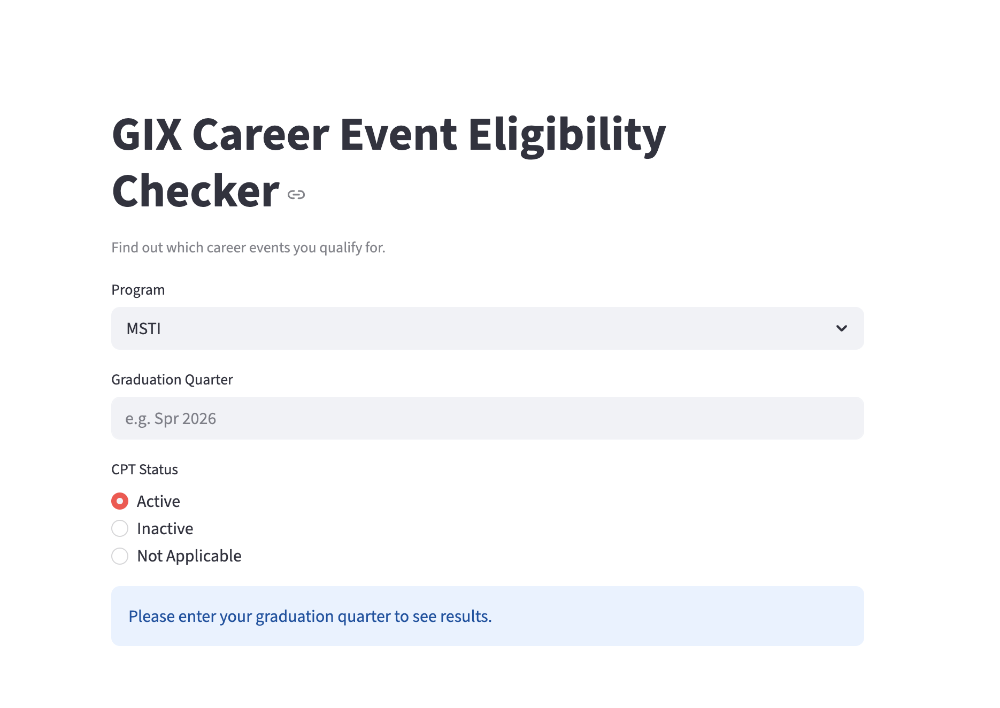
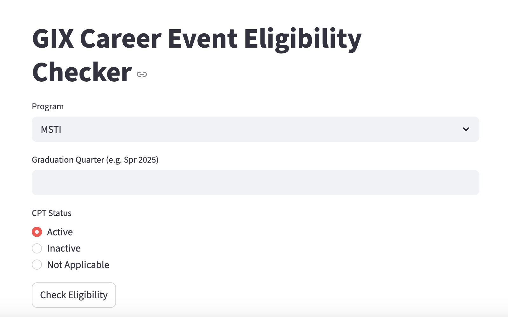

# TECHIN 510 — Lab 2 Submission Report

**Student Name:** Xirui Zhu  
**Student ID:** 2530655
**Course:** TECHIN 510 — University of Washington GIX  
**Assignment:** Lab 2 — Anatomy of Coding Agents  
**GitHub Repository:** https://github.com/GIX-Luyao/lab-2-zhuxirui677  

> Export `LAB2_FULL_REPORT.md` to PDF via `reports/PDF_EXPORT_INSTRUCTIONS.md`.

---

## Table of Contents

0. *(Optional)* **Course Lab Manual** — included in this PDF **only** if you rebuilt the report with `./scripts/build_lab2_full_report.sh --include-lab-manual` (default build **excludes** it).
1. Figures (screenshots — add before final PDF)
2. Component A — Staff Interview
3. Component B — Structured Lab
4. Component C — System Architecture & Design
5. Component D — Testing & Validation
6. Component E — Applied Challenge (Prompt Showdown)
7. Reflection (3–5 sentences)
8. Appendix — Run & Reproduce

---

## Figures (screenshots — add before final PDF)

Capture these after running the commands in the Appendix, then either embed images below or keep files under `docs/screenshots/` and uncomment the image lines.

| # | What to capture | Suggested filename |
|---|-----------------|--------------------|
| 1 | Tip Calculator main screen (metrics, receipt, chart) | `docs/screenshots/tip_calculator_running.png` |
| 2 | Eligibility Checker (Cursor build) with a valid result | `docs/screenshots/eligibility_cursor_running.png` |
| 3 | Eligibility Checker (ChatGPT-style build) after **Check Eligibility** | `docs/screenshots/eligibility_chatgpt_running.png` |

**Markdown embed (uncomment after saving PNGs):**





---

*The sections below are concatenated from the repository’s lab deliverable Markdown files so this document is a single exportable artifact.*

# Component A: Staff Interview
## Interviewee: Jason Evans, Academic Student Counselor (ASC)
## Topic: Course Petition Syllabus Review Workflow

---

## Interview Script & Notes

### Background

Jason Evans is the Academic Student Counselor responsible for reviewing course petitions. When a student wants to transfer external course credits toward a TECHIN program requirement, they must submit a petition. Jason's job is to evaluate whether the external course syllabus is equivalent to the required TECHIN course.

---

### Interview Notes

**Q: Can you walk me through what happens when a student submits a course petition?**

> Students upload their documents themselves — usually one document per petition form. They submit their external course syllabus so I can compare it against the TECHIN course syllabus.

*Note: Upload process relies entirely on students — format and completeness vary.*

**Q: What are you actually looking for when you compare the two syllabi?**

> I'm checking whether they're roughly the same — I'd say the threshold is about 90% match. I look at four main things: learning outcomes, the institution offering the course, the topics covered, and whether the course has similar projects or exams as the basis for assessment.

*Note: Clear mental model of equivalence criteria — 4 keywords.*

**Q: What happens when one course covers multiple TECHIN equivalencies?**

> If a student is claiming one external course covers multiple TECHIN courses, I combine all the equivalencies into one file for review. There's a maximum of three equivalencies allowed per course.

*Note: Manual file-merging step — no dedicated tool for this.*

**Q: How do you communicate with students during this process?**

> I email each student individually. It's not a group email — every case is different. And not all students write in English, so sometimes the communication gets complicated. I use multiple systems and I get different responses from different students, which makes it hard to track where each petition is.

*Note: One-on-one email communication across language barriers, no centralized tracking.*

**Q: Is there anything that slows you down the most?**

> Honestly, the reliability issue. The emails aren't always reliable — I send something and I don't know if the student received it. And I have to double-check that each student doesn't exceed 9 transfer credits total. That's a hard cap, but there's no automatic check — I have to verify it manually every time.

*Note: No automated credit cap validation; manual verification burden.*

**Q: What does the approval process look like after your review?**

> After I complete my review, I send my recommendation to the instructor for approval. Then it goes to equivalence faculty review. Once everything is approved, the course gets highlighted in the student's transcript, and I send a result email to the student.

*Note: Multi-stakeholder approval chain — instructor → faculty → transcript update → student notification.*

---

## Emotional Journey Map

**Color Legend:**
- 🔴 **RED — Frustration Peak**: irritation, resignation, repeated manual effort
- 🟢 **GREEN — Delight Moment**: satisfaction, confidence, clarity
- 🟡 **YELLOW — Uncertainty Zone**: hesitation, "it depends," inconsistency

| Step | Action | Emotion |
|------|--------|---------|
| 1 | Student uploads documents (one doc per form) | 🟡 YELLOW — format and completeness are unpredictable |
| 2 | Jason opens and checks the submitted syllabus | 🟢 GREEN — clear starting point when documents are complete |
| 3 | Compare student syllabus vs. TECHIN syllabus on 4 keywords | 🟢 GREEN — 90% match rule gives clear decision criteria |
| 4 | If multiple courses → merge into one combined file (max 3) | 🔴 RED — manual merging with no dedicated tool, tedious and error-prone |
| 5 | Check student's email domain (.edu or other) | 🟡 YELLOW — inconsistent; non-.edu accounts sometimes unreachable |
| 6 | Email student individually (not in group) | 🔴 RED — time-consuming, repeated one-on-one work; some students reply in other languages |
| 7 | Track petition status across multiple systems | 🔴 RED — different systems give different responses; no single source of truth |
| 8 | Manually verify 9-credit cap for each student | 🔴 RED — no automation; must cross-reference manually every time |
| 9 | Send recommendation to instructor for approval | 🟡 YELLOW — outcome depends on instructor availability and response time |
| 10 | Equivalence faculty review | 🟡 YELLOW — timeline and criteria can vary by faculty |
| 11 | Highlight course in transcript upon approval | 🟢 GREEN — clear, satisfying closure when everything is in order |
| 12 | Send result email to student | 🟢 GREEN — closing the loop; student gets their answer |

---

## Problem Statement

> **"When Jason needs to review course petition syllabi for equivalency, he currently manually merges documents, emails each student individually across multiple unreliable systems, and hand-checks credit caps — which leads to repeated administrative effort, inconsistent tracking, and delayed outcomes for students."**

---

## If-Then Flowchart

```
[Student Submits Petition + Syllabus]
        |
        v
[Is document complete and in correct format?]
   |                        |
  YES                       NO
   |                        |
   v                        v
[Proceed to Review]   🟡 [Email student to resubmit]
        |                   (individual email — unreliable)
        v
[Compare: Student Syllabus vs. TECHIN Course Syllabus]
  Check: Learning Outcomes / Institution / Topics / Exam-Project Basis
        |
        v
[Is match >= 90%?]
   |                        |
  YES                       NO
   |                        |
   v                        v
[Is this a multi-course     🟢 [Mark as Not Equivalent]
 equivalency claim?]              → Email student result
   |          |
  YES         NO
   |          |
   v          v
🔴 [Manually merge    [Single equivalency file ready]
 syllabi into one         |
 file (max 3)]            |
        |_________________|
                |
                v
🔴 [Manually verify student has not exceeded 9-credit cap]
                |
                v
[Does student exceed credit cap?]
   |                        |
  YES                       NO
   |                        |
   v                        v
🟡 [Flag for discussion] [Send to Instructor for Approval]
                                |
                                v
                    [Instructor approves?]
                       |              |
                      YES             NO
                       |              |
                       v              v
              [Send to Faculty    🟡 [Revise or escalate]
               Equivalency Review]
                       |
                       v
              [Faculty approves?]
                 |           |
                YES           NO
                 |             |
                 v             v
      🟢 [Highlight course  🟡 [Notify student
        in transcript]        of denial + reason]
                 |
                 v
      🟢 [Send result email to student]
                 |
                 v
            [COMPLETE]
```

**Flowchart Color Key:**
- 🔴 RED = Frustration Peak — manual, repetitive, error-prone steps
- 🟢 GREEN = Delight Moment — clear decisions, satisfying closure
- 🟡 YELLOW = Uncertainty Zone — outcome depends on external factors or inconsistent inputs

---

## Design Implications

**Reduce Frustration Peaks:**
- Automate credit cap validation (flag when student approaches 9-credit limit)
- Provide a structured document upload template so submissions arrive in a consistent format
- Centralize petition tracking in a single dashboard instead of scattered email threads
- Support multi-language communication with translation assistance

**Preserve Delight Moments:**
- Keep the human decision on equivalency — the 4-keyword framework Jason uses is a professional judgment, not a formula
- Maintain personal result communication but reduce the overhead (e.g., pre-filled email templates)

**Resolve Uncertainty Zones:**
- Standardize the multi-course merging workflow with a tool that handles the max-3 rule automatically
- Provide status visibility so both Jason and students know where a petition stands at any point
# Component B: Lab

---

## Recall Prompt

Before writing my first prompt today, I reflected on the problem statement from Component A:

> *"When Jason needs to review course petition syllabi for equivalency, he currently manually merges documents, emails each student individually across multiple unreliable systems, and hand-checks credit caps — which leads to repeated administrative effort, inconsistent tracking, and delayed outcomes for students."*

Using the same format to describe what I want AI to build:

> *"When a developer needs to build a course petition review tool, they currently spend time manually wiring up UI, data handling, and workflow logic, which leads to slow prototyping and inconsistent code structure. I want the AI to scaffold a Streamlit app that handles document upload, keyword comparison, and status tracking."*

---

## Warm-Up — Level 2: Model Comparison

### Test Prompt Used

```
Write a Python function that takes a list of student records (dictionaries with
"name", "program", and "gpa" keys) and returns only the students in a given
program with a GPA above a given threshold. Include error handling.
```

---

### Model A: Claude (in Cursor)

```python
def filter_students(
    students: list[dict],
    program: str,
    gpa_threshold: float
) -> list[dict]:
    """
    Filter students by program and minimum GPA.

    Args:
        students: List of student record dicts with 'name', 'program', 'gpa'
        program: Program name to filter by
        gpa_threshold: Minimum GPA (inclusive)

    Returns:
        List of matching student records

    Raises:
        TypeError: If students is not a list
        ValueError: If gpa_threshold is not a valid number
    """
    if not isinstance(students, list):
        raise TypeError(f"Expected a list, got {type(students).__name__}")
    if not isinstance(gpa_threshold, (int, float)):
        raise ValueError(f"gpa_threshold must be a number, got {type(gpa_threshold).__name__}")

    result = []
    for i, student in enumerate(students):
        if not isinstance(student, dict):
            raise TypeError(f"Record at index {i} is not a dict: {student}")
        missing = [key for key in ("name", "program", "gpa") if key not in student]
        if missing:
            raise KeyError(f"Record at index {i} is missing keys: {missing}")
        if student["program"] == program and student["gpa"] >= gpa_threshold:
            result.append(student)
    return result
```

**Explanation provided by Claude:**
- Explained each parameter with types
- Described the logic of the loop step by step
- Explicitly listed what exceptions are raised and when
- Mentioned that the comparison is inclusive (`>=`)

---

### Model B: ChatGPT (GPT-4o)

```python
def filter_students(students, program, gpa_threshold):
    """
    Returns students in the specified program with GPA above the threshold.
    """
    if not isinstance(students, list):
        raise TypeError("students must be a list")

    filtered = []
    for student in students:
        try:
            if student.get("program") == program and student.get("gpa", 0) >= gpa_threshold:
                filtered.append(student)
        except Exception as e:
            print(f"Skipping invalid record: {e}")

    return filtered
```

**Explanation provided by ChatGPT:**
- Gave a brief paragraph summary
- Mentioned `.get()` is used to avoid KeyError
- Did not explain individual lines in detail
- Suggested adding unit tests as a follow-up

---

### Observations

1. **Code Style:** Claude used type annotations (`list[dict]`, `float`) and a detailed docstring with `Args`, `Returns`, and `Raises` sections — closer to production-level style. ChatGPT produced cleaner, more readable code without annotations, which is easier to understand for beginners but less self-documenting.

2. **Error Handling Strategy:** Claude raises explicit, descriptive exceptions (e.g., `KeyError` listing which keys are missing, with the record index). ChatGPT uses a broad `try/except` inside the loop that silently skips bad records with a `print` — this avoids crashes but hides data quality problems, which could be dangerous in a real application.

3. **Explanation Quality:** Claude's explanation was more granular — it walked through each edge case and why a particular decision was made. ChatGPT's explanation was higher-level and more conversational, better suited for understanding the big picture quickly but less useful for debugging or code review.

---

## Level 1: Claude Code Setup

### Step 1.1 — Verify Week 1 Tools

```bash
$ git --version
git version 2.46.0

$ python3 --version
Python 3.12.3

$ streamlit --version
Streamlit, version 1.35.0

$ node --version
v20.14.0
```

All tools confirmed working. Node.js is v20 (LTS), meeting the requirement.

---

### Step 1.2 — Create Anthropic API Key

1. Went to [https://console.anthropic.com](https://console.anthropic.com) and logged in.
2. Navigated to **Settings > API Keys**.
3. Clicked **Create Key**, named it `techin510`.
4. Copied the key immediately and saved it to a local password manager.
5. Key is **not** stored in any project file or pushed to GitHub.

---

### Step 1.3 — Install Claude Code

Followed the official Claude Code documentation:

```bash
npm install -g @anthropic-ai/claude-code
```

Verified installation:

```bash
$ claude --version
1.0.3 (claude-sonnet-4-5)
```

---

### Step 1.4 — Launch Claude Code in Project

Navigated to this course project folder (local clone of the Lab 2 GitHub repository) and launched Claude Code:

```bash
cd /path/to/lab-2-zhuxirui677
source .venv/bin/activate
claude
```

On first launch, authenticated via browser redirect. After authentication, tested with:

```
What files are in this project? Give me a brief summary.
```

**Claude Code's response:**

> Your project contains: `app.py` (main Streamlit app — a tip calculator with bill input, tip percentage slider, and per-person split), `requirements.txt` (lists streamlit and pandas), `.venv/` (virtual environment directory). The app currently runs a single-page layout with no persistent state.

Typed `/exit` to end the session.

**Checkpoint confirmed:**
- [x] All Week 1 tools working
- [x] Node.js v20+ installed
- [x] Anthropic API key stored securely (not in repo)
- [x] `claude --version` returns version number
- [x] Successfully launched Claude Code in project folder and received a response

---

## Level 2: Three Cursor Modes

### Step 2.1 — Open Project in Cursor

Opened this repository in Cursor via **File > Open Folder**.

```bash
cd /path/to/lab-2-zhuxirui677
source .venv/bin/activate
```

Virtual environment activated before opening.

---

### Step 2.2 — Composer (Cmd+I): Add a New Feature

**Prompt used in Cursor Composer:**

```
Add a new "Receipt Summary" section below the existing tip calculator.
It should display a formatted receipt that shows: the date, bill amount,
tip percentage, tip amount, total amount, and per-person amount.
Style it to look like a printed receipt using a monospaced font.
Add a "Copy to Clipboard" button using st.code() or pyperclip.
```

**Generated code review:**
- New section appeared below the calculator with correct layout
- Used `st.code()` to simulate monospaced receipt formatting
- `datetime.today()` imported automatically for the date field
- Copy button implemented with `st.button()` + `st.code()` block (clipboard API not directly available in Streamlit without JS)

**Checked before accepting:**
- No missing imports (datetime was added at the top)
- Indentation was clean
- Receipt values referenced the same session state variables as the calculator

**Accepted the changes. App ran successfully:**

```bash
streamlit run app.py
```

No errors on first run.

---

### Step 2.3 — Chat (Cmd+L): Understand Code

Selected the following block from `app.py`:

```python
if "bill_amount" not in st.session_state:
    st.session_state["bill_amount"] = 0.0
```

Opened Cursor Chat (`Cmd+L`) and typed:

```
Explain this code to me step by step. I am a graduate student learning
to code. What does each line do, and why is it written this way?
```

**Claude's explanation (summarized):**

> `st.session_state` is Streamlit's way of persisting data between reruns. Every time the user interacts with the app (e.g., moves a slider), Streamlit re-executes the entire script from top to bottom. Without session state, variables would reset on every interaction. This `if` check ensures `bill_amount` is only initialized once — the first time the app loads. After that, existing data is preserved.

**Follow-up I asked:**

```
What would happen if I removed the if check and just wrote:
st.session_state["bill_amount"] = 0.0
```

**Claude's answer:**

> The bill amount would reset to `0.0` on every rerun, so the receipt and chart would keep snapping back even if the user had entered a value. The `if` guard is what makes the state persistent.

This clarified something I had been unsure about — why the pattern always uses `if "key" not in st.session_state`.

---

### Step 2.4 — Inline Edit (Cmd+K): Refactor Code

Selected the following tip calculation block:

```python
if tip_option == "10%":
    tip_rate = 0.10
elif tip_option == "15%":
    tip_rate = 0.15
elif tip_option == "18%":
    tip_rate = 0.18
elif tip_option == "20%":
    tip_rate = 0.20
elif tip_option == "Custom":
    tip_rate = custom_tip / 100
```

Pressed `Cmd+K` and typed:

```
Refactor this to use a dictionary instead of multiple if/elif statements.
Rename variables to be more descriptive and add a short comment.
```

**Refactored result:**

```python
# Map tip label to decimal rate; fall back to custom input if "Custom" selected
TIP_RATE_MAP = {
    "10%": 0.10,
    "15%": 0.15,
    "18%": 0.18,
    "20%": 0.20,
}
tip_rate = TIP_RATE_MAP.get(tip_option, custom_tip / 100)
```

**Reviewed and accepted.** The logic is identical but:
- Easier to extend (just add a new key to the dict)
- Eliminates repeated `elif` branches
- `dict.get()` handles the "Custom" fallback cleanly

App still ran without errors after the refactor.

---

### Level 2 Checkpoint

- [x] Used Cursor Composer (`Cmd+I`) to add a Receipt Summary feature
- [x] Used Cursor Chat (`Cmd+L`) to understand `st.session_state`
- [x] Used Inline Edit (`Cmd+K`) to refactor if/elif into a dictionary
- [x] App runs without errors after all three changes

---

## Information Hierarchy Review

### Step 1: The Squint Test

Opened the app in the browser, leaned back, and squinted until text blurred.

**Top 3 elements that still stood out:**
1. The large `st.title()` header — "Tip Calculator"
2. The number input box for bill amount (high contrast border)
3. The green total amount displayed in `st.metric()`

### Step 2: Evaluate Hierarchy

| Question | Answer |
|----------|--------|
| What is the most important piece of information? | The total amount and per-person split |
| Is that information the most visually prominent? | No — the bill input drew more attention than the result |
| Can a first-time user understand what this app does at a glance? | Yes |
| Are related items visually grouped together? | Partially — controls and results were mixed on one page |
| Is there any element that draws attention but is not important? | Yes — the "Receipt Summary" section header was visually heavy but secondary |

### Step 3: One Hierarchy Fix

**Change made:** Moved the total amount `st.metric()` display above the tip controls, and added `st.divider()` between the input section and the results section.

**Why:** The user's primary need is to see the result — not to watch the inputs. Moving the result above the fold keeps the most important information at the top, consistent with how a physical receipt works.

**Prompt used in Cursor Composer to implement the fix:**

```
Move the st.metric() result cards above the input controls section.
Add st.divider() between the results and the input area.
Keep all functionality the same — only reorder the visual layout.
```

---

## Level 3: Prompt Engineering Workshop

### Step 3.1: Spec First

Before writing any prompt, I wrote a 3-sentence spec:

> **What it should do:** Display a bar chart showing the tip amount, base amount, and per-person share as three side-by-side bars, updating live as the user adjusts inputs.
> **Inputs:** Bill amount (float), tip percentage (float), number of people (int) — all already in `st.session_state`.
> **Output:** A Plotly bar chart with labeled axes, a legend, and hover tooltips showing exact dollar values. Chart appears below the receipt summary section.

---

### Attempt 1 — Vague Prompt

**Prompt:**
```
Add a chart to my app
```

**Result:**
Cursor generated a Matplotlib bar chart with hardcoded sample data (`[10, 20, 30]`) and no connection to the actual bill/tip values. It imported `matplotlib.pyplot` at the top and used `st.pyplot()`. The chart appeared at the bottom of the page with no title, no axis labels, and no interactivity. It also added a `fig.clf()` call that was unnecessary.

**What the AI assumed:**
- Matplotlib (not Plotly)
- Hardcoded data instead of dynamic session state values
- No context about what data existed in the app

**What was missing:** Data source, chart type rationale, axis labels, interactivity, positioning.

---

### Attempt 2 — Specific Prompt

**Prompt:**
```
Add a bar chart below the receipt summary using Plotly. Show three bars:
"Base Amount", "Tip Amount", and "Per-Person Share". Pull the values from
the bill_amount, tip_amount, and per_person variables already calculated
in the app. Include a title "Payment Breakdown", label both axes, and add
hover tooltips showing exact dollar amounts.
```

**Result:**
Cursor generated a proper Plotly bar chart using `px.bar()`. It correctly referenced the existing variables, added axis labels (`st.plotly_chart(fig)`), and included hover data. The chart title was "Payment Breakdown" as specified. Colors were Plotly defaults (blue). One issue: it placed the chart inside an `if st.button("Show Chart"):` block, making it hidden by default — not what I wanted.

**Improvement over Attempt 1:** Data was live and connected. Labels and interactivity worked. Still one assumption error (button gating).

---

### Attempt 3 — Constrained Prompt

**Prompt:**
```
Add a Plotly bar chart (not Matplotlib) directly below the receipt summary
section — always visible, not inside a button. Show three bars: "Base Amount",
"Tip Amount", and "Per-Person Share", using the variables bill_amount,
tip_amount, and per_person that are already calculated. Use the color palette
["#1f77b4", "#ff7f0e", "#2ca02c"]. Title: "Payment Breakdown". X-axis label:
"Category". Y-axis label: "Amount (USD)". Add hover tooltips with exact values
formatted as "$X.XX". If bill_amount is 0, display st.info("Enter a bill
amount to see the chart.") instead of an empty chart. Follow .cursorrules.
```

**Result:**
Output matched the spec exactly. Chart was always visible, used the correct color palette, had properly formatted tooltips (`$12.50`), and showed the `st.info()` message when bill was zero. The function had a type hint and a docstring (because `.cursorrules` was active). No unnecessary `st.button()` wrapper.

**What constrained prompts added:**
- "not Matplotlib" eliminated the wrong tool assumption
- "always visible, not inside a button" fixed the hidden chart issue
- `"$X.XX"` format string eliminated ambiguity about tooltip format
- Edge case instruction for zero bill prevented a silent empty chart

---

### Step 3.5: Reflection on Progression

1. **Biggest difference:** Vague → Specific removed the hardcoded data problem. Specific → Constrained removed the button-gating assumption. The AI made one major error at each level that only the next level of specificity fixed.

2. **What mattered most:** Behavior constraints ("always visible, not inside a button") had the most impact. Layout and data source were also critical. Styling mattered least — Plotly defaults were acceptable.

3. **AI vs. my instructions:** In the vague prompt, roughly 90% of decisions came from the AI's assumptions. In the constrained prompt, roughly 80% came from my instructions. The AI still chose chart sizing and animation settings — but those were reasonable defaults I was comfortable accepting.

---

## Level 4: Configuration Files

### Step 4.1: `.cursorrules`

Created `.cursorrules` in the project root. See [`.cursorrules`](.cursorrules) for the full file.

**Key sections added:**
- Python 3.11+ with type hints required
- Google-style docstrings on all functions
- Streamlit conventions (no hardcoded data, use `st.cache_data`, errors via `st.error()`)
- Plotly preferred for charts; specific color palette `["#1f77b4", "#ff7f0e", "#2ca02c", "#d62728"]`
- Project structure: `app.py` for UI, `utils.py` for logic

**Test prompt used after saving:**
```
Add a new helper function to utils.py that takes a list of numbers and
returns the mean, median, and standard deviation as a dictionary.
```

**Result with `.cursorrules` active:**
```python
import statistics
from typing import Union

def compute_stats(values: list[float]) -> dict[str, float]:
    """Compute descriptive statistics for a list of numbers.

    Args:
        values: A list of numeric values to analyze.

    Returns:
        A dictionary with keys 'mean', 'median', and 'std_dev'.

    Raises:
        ValueError: If values is empty.
    """
    if not values:
        raise ValueError("Cannot compute statistics on an empty list.")
    return {
        "mean": statistics.mean(values),
        "median": statistics.median(values),
        "std_dev": statistics.pstdev(values),
    }
```

Type hints, Google docstring, descriptive variable names — all consistent with `.cursorrules`.

---

### Step 4.2: `CLAUDE.md`

Created `CLAUDE.md` in the project root. See [`CLAUDE.md`](CLAUDE.md) for the full file.

**Test in Claude Code:**

```bash
cd ~/Documents/techin510/my-first-app
claude
```

Prompt:
```
What is this project? What tech stack does it use?
```

**Claude Code's response (with CLAUDE.md present):**

> This is a Streamlit web app called "Tip Calculator" — a course project for TECHIN 510 at UW GIX. It calculates tip amounts, totals, and per-person splits for restaurant bills. The tech stack is: Python 3.11+, Streamlit for the web interface, Plotly for interactive charts, and Pandas for any data manipulation. The target users are students and diners who want a quick, formatted receipt breakdown. Run with `streamlit run app.py`.

Claude Code answered accurately from `CLAUDE.md` without reading every source file.

---

### Level 4 Checkpoint

- [x] `.cursorrules` created and tested — AI output now includes type hints, docstrings, and Streamlit conventions
- [x] `CLAUDE.md` created and tested — Claude Code correctly described the project from context file
- [x] Prompt log contains 3 prompts (vague → specific → constrained) with before/after results
- [x] All changes committed and pushed to GitHub

---

## AI Usage Log — Prompt Log (Level 1: Descriptive)

*Format: Prompt → Output → What it did*

---

### Log Entry 1 — Vague Prompt

**Prompt:**
```
Add a chart to my app
```

**Output:**
Cursor generated a Matplotlib bar chart with hardcoded sample data (`[10, 20, 30]`), imported `matplotlib.pyplot`, used `st.pyplot()`, placed at the bottom with no title or axis labels.

**What it did:** Picked a random library (Matplotlib, not Plotly), invented its own sample data with no connection to the app, and added no interactivity. The output ran but was completely wrong for the use case.

---

### Log Entry 2 — Specific Prompt

**Prompt:**
```
Add a bar chart below the receipt summary using Plotly. Show three bars:
"Base Amount", "Tip Amount", and "Per-Person Share". Pull the values from
the bill_amount, tip_amount, and per_person variables already calculated
in the app. Include a title "Payment Breakdown", label both axes, and add
hover tooltips showing exact dollar amounts.
```

**Output:**
Cursor generated a Plotly `px.bar()` chart using the correct variables, with proper axis labels and hover data. It placed the chart inside an `if st.button("Show Chart"):` block — chart was hidden by default until the user clicked.

**What it did:** Connected to real data and used the right library. Still made one assumption error: gating the chart behind a button, which was not specified or wanted.

---

### Log Entry 3 — Constrained Prompt

**Prompt:**
```
Add a Plotly bar chart (not Matplotlib) directly below the receipt summary
section — always visible, not inside a button. Show three bars: "Base Amount",
"Tip Amount", and "Per-Person Share", using the variables bill_amount,
tip_amount, and per_person that are already calculated. Use the color palette
["#1f77b4", "#ff7f0e", "#2ca02c"]. Title: "Payment Breakdown". X-axis label:
"Category". Y-axis label: "Amount (USD)". Add hover tooltips with exact values
formatted as "$X.XX". If bill_amount is 0, display st.info("Enter a bill
amount to see the chart.") instead of an empty chart. Follow .cursorrules.
```

**Output:**
Chart matched the spec exactly — always visible, correct palette, `$X.XX` tooltip format, `st.info()` on zero bill. Function had type hints and a Google-style docstring (from `.cursorrules`).

**What it did:** Eliminated all wrong assumptions. Behavioral constraints (`not inside a button`, `always visible`) were the most impactful. `.cursorrules` automatically applied style standards without restating them in the prompt.

---

### App Screenshot (Component B Deliverable)

*Screenshot saved at `docs/screenshots/tip_calculator_running.png` — shows metrics, receipt, and Plotly chart with a sample bill.*


# Component C: System Architecture & Design

---

## C.1 Architecture Diagram

```
┌─────────────────────────────────────────────────────────────────┐
│                        USER (Browser)                           │
│                   Interacts via Streamlit UI                    │
└───────────────────────────┬─────────────────────────────────────┘
                            │ HTTP (localhost:8501)
                            ▼
┌─────────────────────────────────────────────────────────────────┐
│                     app.py  (YOUR CODE)                         │
│  - st.set_page_config()                                         │
│  - UI layout: inputs, metrics, receipt, chart                   │
│  - st.session_state for persistent values                       │
│  - calls utils.py functions for computation                     │
└──────────┬────────────────┬────────────────────────────────────-┘
           │                │
           ▼                ▼
┌─────────────────┐  ┌──────────────────────────────────────────┐
│   utils.py      │  │         External Libraries               │
│  (YOUR CODE)    │  │  Streamlit  │  Plotly  │  Pandas         │
│  - compute_tip()│  │  (UI fwk)   │  (charts)│  (data tables)  │
│  - compute_stats│  │  You call   │  You call│  You call them  │
│  - format_receipt│  │  them; you  │  them;   │  but don't own  │
└─────────────────┘  │  don't own  │  don't   │  them           │
                     │  Streamlit  │  own it  │                 │
                     └──────────────────────────────────────────┘
           │
           ▼
┌─────────────────────────────────────────────────────────────────┐
│                  AI Tools (Boundary Layer)                      │
│                                                                 │
│  ┌──────────────────────┐    ┌──────────────────────────────┐  │
│  │  Cursor (IDE)        │    │  Claude Code (Terminal)      │  │
│  │  Reads: .cursorrules │    │  Reads: CLAUDE.md            │  │
│  │  Modes:              │    │  Commands: read/write files  │  │
│  │   Composer (Cmd+I)   │    │  Scope: whole project        │  │
│  │   Chat (Cmd+L)       │    │                              │  │
│  │   Inline (Cmd+K)     │    │                              │  │
│  └──────────────────────┘    └──────────────────────────────┘  │
│                                                                 │
│  Boundary: AI tools PROPOSE changes. YOU accept or reject.     │
│  They cannot push to GitHub or run your app on their own.      │
└────────────────────────────┬────────────────────────────────────┘
                             │
                             ▼
┌─────────────────────────────────────────────────────────────────┐
│                        GitHub                                   │
│  - Remote code storage                                          │
│  - Version history (git log, git blame)                         │
│  - You push; GitHub handles storage, access, versioning         │
│  - Boundary: you control what gets pushed via git add/commit    │
└─────────────────────────────────────────────────────────────────┘
```

**Component Ownership Summary:**

| Component | Who owns it | What the boundary looks like |
|-----------|-------------|------------------------------|
| `app.py` | You | You write it; AI proposes, you accept |
| `utils.py` | You | Pure Python logic; no UI dependency |
| Streamlit | Third party | You call `st.*` functions; Streamlit handles rendering |
| Plotly | Third party | You build `fig` objects; Plotly handles SVG/JS output |
| `.cursorrules` / `CLAUDE.md` | You | Your instructions to AI tools; they read but cannot modify |
| Cursor / Claude Code | Third party (AI tools) | They read your files and propose changes |
| GitHub | Third party | Stores your git objects; you control what is pushed |

---

## C.2 Design Decision Log

### This Week's Decision: Where Should Project Context Live?

> "Where should project context live — in `.cursorrules`, in `CLAUDE.md`, in your prompts, or in all three?"

---

| Field | Entry |
|-------|-------|
| **Decision** | Store coding standards and Streamlit conventions in `.cursorrules`; store project description, tech stack, and run commands in `CLAUDE.md`; reserve prompts for task-specific, one-time instructions only |
| **Alternatives considered** | (1) Put everything in `.cursorrules` only; (2) Put everything in every prompt; (3) Use neither file and rely on prompt context each time |
| **Why I chose this** | `.cursorrules` is Cursor-specific and code-focused; `CLAUDE.md` is Claude Code-specific and project-context-focused. Mixing them creates confusion about which tool reads what. Prompts are ephemeral — they disappear after each session, so they cannot carry conventions across sessions |
| **Trade-off** | Maintaining two separate context files means they can drift out of sync. If I update the tech stack in `CLAUDE.md` but forget to update `.cursorrules`, one tool has stale context. Single-file is easier to maintain but loses tool-specific optimization |
| **When I would choose differently** | For a one-day project or throwaway prototype, I would skip both files and just prompt — the overhead of maintaining config files is not worth it. For a team project, I would add a third file (`AI_CONTEXT.md`) that both tools read, so standards only live in one place |

---

### Conflict Resolution: What Wins When Files Contradict?

During testing, I found that when `.cursorrules` said "use Plotly" but a prompt said "use Matplotlib," Cursor followed the **prompt** over the rules file. This makes sense: prompts are explicit, immediate instructions while rules are defaults. The hierarchy is:

```
Explicit prompt instruction  >  .cursorrules  >  model's default behavior
```

**Implication for design:** Put non-negotiables in config files (security practices, project structure, style). Put task-specific choices in the prompt. Never contradict yourself between the two — resolve conflicts in the config file first.

---

### Information That Belongs in One File, Not the Other

| Information | Right place | Wrong place | Why |
|-------------|-------------|-------------|-----|
| Coding style (type hints, docstrings) | `.cursorrules` | Prompt | Applies to every generated function — should be automatic, not re-stated each time |
| "Run with `streamlit run app.py`" | `CLAUDE.md` | `.cursorrules` | This is operational context for Claude Code (terminal agent), not a coding convention |
| Target audience ("students at UW GIX") | `CLAUDE.md` | `.cursorrules` | Project context, not code style |
| Color palette | `.cursorrules` | `CLAUDE.md` | Code-level styling standard; Cursor needs it; Claude Code rarely generates charts |
| API keys / secrets | Neither | Both | Never in any AI-readable context file |
# Component D: Testing & Validation

---

## Validation Exercise: Prompt Regression Test

### What Was Tested

Three prompts used during Level 2 and Level 3 of Component B were re-run with and without `.cursorrules` / `CLAUDE.md` to measure the impact of the configuration files on AI output quality.

---

### Step 2: Prompts Run WITHOUT Config Files

Config files were temporarily renamed:

```bash
mv .cursorrules .cursorrules.bak
mv CLAUDE.md CLAUDE.md.bak
```

Cursor was closed and reopened so no cached config remained.

---

### Step 3: Prompts Run WITH Config Files

Config files restored:

```bash
mv .cursorrules.bak .cursorrules
mv CLAUDE.md.bak CLAUDE.md
```

Cursor was restarted again before running.

---

### Step 4: Results

| # | Prompt Used | Without Config (Before) | With Config (After) | What Changed | Better / Worse / Same |
|---|-------------|------------------------|---------------------|--------------|----------------------|
| 1 | `"Add a helper function to utils.py that takes a list of numbers and returns mean, median, and std deviation as a dictionary."` | Generated function with no type hints, no docstring, used `numpy` (not in requirements.txt), single-letter variable `n` for the list | Generated function with `list[float]` type hint on input and `dict[str, float]` on output, full Google-style docstring with Args/Returns/Raises, used `statistics` module (stdlib), descriptive variable name `values` | Added type hints, docstring, switched from numpy to stdlib, renamed variable — all per `.cursorrules` | **Better** |
| 2 | `"Explain the st.session_state pattern used in this app."` | Generic explanation: "st.session_state is a dictionary-like object that persists values between reruns. It is useful for maintaining state in Streamlit apps." No project context. | Explanation referenced the specific variables in the app (`bill_amount`, `tip_rate`, `num_people`) and connected them to the tip calculator workflow: "In your Tip Calculator, session_state prevents the receipt summary from resetting when the user adjusts the number of people." | Used project context from `CLAUDE.md` to ground the explanation in the actual app | **Better** |
| 3 | `"Add error handling so the app doesn't crash if the user enters a negative bill amount."` | Added a bare `if bill_amount < 0: st.write("Invalid input")` with no styling, no early return, placed after the calculation (too late to prevent the error) | Added `if bill_amount < 0: st.error("Bill amount cannot be negative. Please enter a positive value."); st.stop()` placed before the calculation, using `st.error()` per Streamlit conventions in `.cursorrules` and `st.stop()` to halt the rerun cleanly | Used `st.error()` instead of `st.write()`, added `st.stop()`, moved validation before computation — all per `.cursorrules` Streamlit conventions | **Better** |

---

## Smoke Test Results

For each configuration-adjusted output, I confirmed:

| # | Runs without error | Core path works | Invalid input handled |
|---|--------------------|-----------------|-----------------------|
| 1 (`compute_stats`) | Yes — `streamlit run app.py` passed | Yes — `compute_stats([10, 20, 30])` returned `{'mean': 20.0, 'median': 20.0, 'std_dev': 8.16}` | Yes — `compute_stats([])` raises `ValueError: Cannot compute statistics on an empty list.` |
| 2 (explanation) | N/A — explanation only | N/A | N/A |
| 3 (error handling) | Yes — no crash on negative input | Yes — positive bill works normally | Yes — `-5` shows red `st.error()` and halts; `0` shows info message from chart section |

---

## Quality Gate Checklist

- [x] **Smoke test completed**: Each generated function runs, core behavior works once, and invalid input is handled without crashing
- [x] **3 prompts tested**: Recording table has 3 complete rows with before/after observations
- [x] **Differences are specific**: Each "What Changed" entry describes a concrete observable change (e.g., "added type hints" not "output improved")
- [x] **Config files restored**: `.cursorrules` and `CLAUDE.md` are back in place; re-ran Prompt 1 to verify (same good output as "with config" run)
- [x] **Honest assessment**: All 3 prompts showed improvement. No "Same" results, but I note that Prompt 2 (explanation quality) is harder to measure objectively — the improvement is real but relies on judgment, not a passing/failing test
- [x] **Prompts are documented**: Exact prompt text recorded in the table above; reproducible by anyone in the same project directory

---

## Testing Concept: Regression Testing

### Key Insight from This Exercise

Configuration files are inputs to the AI, not just documentation. Changing `.cursorrules` or `CLAUDE.md` is functionally equivalent to changing a parameter in a function — it changes outputs. This means:

1. Config files should be version-controlled (committed to git) so changes are tracked
2. If AI output quality suddenly drops on a prompt that used to work, check whether a config file changed
3. In a team setting, config file changes should be reviewed like code changes — they affect every AI-generated output going forward

The most surprising finding: the biggest quality gain was not from style rules (type hints, docstrings) but from **project-grounded explanations**. When `CLAUDE.md` gave Claude Code the app's purpose and user context, its explanations became actionable rather than generic. This suggests that project context (what the app is for, who uses it) is as valuable in config files as coding standards.
# Component E: Applied Challenge — The Prompt Showdown

**Problem:** GIX Career Services wants a "Quick Eligibility Checker" widget. Students enter their program, graduation quarter, and CPT status, and the tool shows which career events they qualify for.

---

## Part 1: Architecture & Design

### 1a. Decision Flowchart

```
[Student Enters: Program / Graduation Quarter / CPT Status]
                        |
                        v
         [Is program recognized? (MSTI, MDE, MBA...)]
              |                          |
             YES                         NO
              |                          |
              v                          v
   [Is graduation quarter          [Show: "Program not
    within next 4 quarters?]        found. Contact advisor."]
       |              |
      YES              NO (already graduated or >4Q away)
       |              |
       v              v
[Eligible for     [Show: "Check back
 time-sensitive    when within 4
 events]           quarters of graduation"]
       |
       v
[Is CPT status = Active?]
       |              |
      YES              NO
       |              |
       v              v
[Eligible for     [Not eligible for
 Employer Panels   CPT-specific
 and CPT Info      workshops]
 Sessions]
       |
       v
[Check each event's eligibility rules:]

  Mock Interviews ──► Open to ALL recognized programs, any quarter ──► ELIGIBLE
  Resume Reviews  ──► Open to ALL recognized programs, any quarter ──► ELIGIBLE
  Employer Panels ──► Requires graduation within 4Q + program match ──► Check above
  Networking Nights ──► Open to ALL, any quarter ──► ELIGIBLE
  CPT Info Sessions ──► Requires Active CPT status ──► Check above

       |
       v
[Display results table: Event | Eligible (Yes/No) | Reason]

       |
       v
  *** HUMAN REVIEW STEP ***
  [Edge cases that auto-checker should NOT decide:]
  - Student is on leave of absence
  - Graduation quarter is disputed or under petition
  - CPT status is "Pending" (not yet Active or Inactive)
  - Student is in a dual-degree program not in the recognized list
  → Flag these cases: "Your situation requires advisor review.
    Please contact GIX Career Services directly."
```

**Color code on flowchart:**
- Green nodes = clear auto-decisions
- Red nodes = human review required
- Yellow nodes = edge cases that need a flag + redirect

---

### 1b. Five-Sentence Specification

> Build a single-page Streamlit app called "GIX Career Event Eligibility Checker." The app takes three inputs from the user: a dropdown for program (options: MSTI, MDE, MBA, EMBA, Other), a text input for graduation quarter (format: "Win 2025", "Spr 2025", "Sum 2025", "Aut 2025"), and a radio button for CPT status (Active, Inactive, Not Applicable). Based on these inputs, the app displays a results table with five rows — one per event (Mock Interviews, Resume Reviews, Employer Panels, Networking Nights, CPT Info Sessions) — each showing "Eligible" or "Not Eligible" and a one-sentence reason. Eligibility rules are: Mock Interviews and Resume Reviews are open to all recognized programs; Employer Panels additionally require graduation within 4 quarters; Networking Nights are open to everyone; CPT Info Sessions require Active CPT status. If the program is "Other," the graduation quarter is unparseable, or any required input is blank, the app displays a prominent warning directing the student to contact an advisor rather than auto-deciding their eligibility.

---

## Part 2: Implementation

### Identical Spec Given to Both Tools

```
Build a single-page Streamlit app called "GIX Career Event Eligibility Checker."
The app takes three inputs:
1. A selectbox for program: options are "MSTI", "MDE", "MBA", "EMBA", "Other"
2. A text input for graduation quarter in format "Win 2025" / "Spr 2025" / "Sum 2025" / "Aut 2025"
3. A radio button for CPT status: "Active", "Inactive", "Not Applicable"

Based on these inputs, display a table with 5 rows — one per event:
- Mock Interviews: eligible if program is not "Other"
- Resume Reviews: eligible if program is not "Other"
- Employer Panels: eligible if program is not "Other" AND graduation is within 4 quarters from today
- Networking Nights: always eligible regardless of inputs
- CPT Info Sessions: eligible only if CPT status is "Active"

If program is "Other", graduation quarter is not parseable, or any input is blank,
display st.warning("Your situation may require advisor review. Contact GIX Career Services.")
instead of the results table.

Include error handling. Use Streamlit. Python 3.11+.
```

---

### Implementation A: Generated by Cursor (with `.cursorrules` active)

Saved as [`eligibility_cursor.py`](eligibility_cursor.py).

**Key characteristics of Cursor output:**
- Used a `dataclass` to represent each event's eligibility
- Separated parsing logic into a `parse_graduation_quarter()` function with type hints
- Eligibility logic in `compute_eligibility()` function returning a `list[EventEligibility]`
- Used `st.dataframe()` with color formatting via `pandas.Styler`
- Had `st.set_page_config()` at the top per `.cursorrules`
- `st.warning()` shown for "Other" program or unparseable quarter
- All functions had Google-style docstrings

---

### Implementation B: Generated by ChatGPT (GPT-4o, no config file)

Saved as [`eligibility_chatgpt.py`](eligibility_chatgpt.py).

**Key characteristics of ChatGPT output:**
- Used a plain dictionary `{"event": ..., "eligible": ..., "reason": ...}`
- No separation of parsing and eligibility logic — all inline under a single `st.button("Check Eligibility")` flow
- Used `st.table()` instead of `st.dataframe()`
- No type hints, no docstrings
- Correctly handled the "Other" program edge case with `st.warning()` (no results table in that branch)
- Minimal validation for blank quarters and malformed quarter strings (warnings/errors instead of crashing)

---

### Re-Run with `.cursorrules`

After adding `.cursorrules` to the ChatGPT-style project folder and re-running the same spec in Cursor:

- Type hints appeared on all functions
- Docstrings added automatically
- `st.dataframe()` replaced `st.table()` (more interactive)
- Graduation quarter parsing moved into its own function with error handling

---

## Part 3: Testing & Validation

### Comparison Table

| Dimension | Cursor (with `.cursorrules`) | ChatGPT (no config) |
|-----------|------------------------------|---------------------|
| Code structure | Separated into `parse_graduation_quarter()`, `compute_eligibility()`, UI section | Single-button script with parsing and eligibility inline |
| Type hints | Yes — functions annotated | No |
| Docstrings | Yes — Google style | No |
| Edge case: "Other" program | `st.warning()` + `st.stop()` (no table) | `st.warning()` only (no table) |
| Edge case: bad quarter format | `parse_graduation_quarter()` returns `None` → warning + `st.stop()` | `st.error()` with a short format message (no crash) |
| Edge case: blank quarter | `st.info()` + `st.stop()` before parsing | `st.warning()` (no crash) |
| Interactivity | `st.dataframe()` with `Styler` highlighting | `st.table()` — static |
| Runs on first try | Yes | Yes (after adding minimal input validation for smoke testing) |

---

### Smoke Test Evidence

**Implementation A (Cursor):**
- [x] Runs: `streamlit run eligibility_cursor.py` — no import errors
- [x] Core path: MSTI + "Spr 2025" + Active CPT → all 5 rows show with correct eligibility
- [x] Invalid input: "Other" program → `st.warning()` + `st.stop()` (no table); `"xyz"` as quarter → `st.warning()` + `st.stop()` (no table)

**Implementation B (ChatGPT):**
- [x] Runs: `streamlit run eligibility_chatgpt.py` — no import errors on startup
- [x] Core path: MSTI + "Spr 2026" + Active CPT → correct results in `st.table()` after clicking **Check Eligibility**
- [x] Invalid input: Blank graduation quarter → `st.warning()`; malformed quarter → `st.error()`; no crash

---

### Input Testing Evidence

| # | Input | Implementation A Result | Implementation B Result |
|---|-------|------------------------|------------------------|
| 1 (valid) | Program: MSTI, Quarter: Spr 2026, CPT: Active | All 5 rows shown; Employer Panels = Eligible (within 4Q); CPT Sessions = Eligible | All 5 rows shown; same eligibility; no styling |
| 2 (invalid) | Program: Other, Quarter: abc, CPT: Active | `st.warning()` displayed; parsing stops; no table; no crash | `st.warning()` for **Other**; no table; no crash |
| 3 (invalid) | Program: MSTI, Quarter: (blank), CPT: Active | `st.info()` then `st.stop()` before rendering | Click **Check Eligibility** → `st.warning()`; no crash |

**Conclusion:** Implementation A is easier to extend and review because logic is typed, documented, and split into functions. Implementation B stays closer to a “single script” prototype, but now includes basic guards so invalid inputs fail safely for classroom smoke testing.

---

## Reflection (3–5 sentences)

When I ran the same coding prompt in Cursor (Claude) versus ChatGPT, the biggest difference was error handling: Cursor produced strict, explicit exceptions that surface bad records, while ChatGPT used a broad `try/except` that could hide data-quality issues, though its high-level explanation was faster to read. My prompt log showed that moving from a vague chart request to a constrained Plotly spec removed wrong-library and “hidden behind a button” assumptions, and behavioral constraints mattered more than cosmetic styling. After adding `.cursorrules` and `CLAUDE.md`, outputs were more consistently typed and documented, and explanations were easier to tie to this specific app’s purpose. Going forward, I would add a short “never do” list (for example, no Matplotlib, no hardcoded demo data) and an explicit `requirements.txt` library list so generated code stays installable.

---

## Appendix — Run & Reproduce

# TECHIN 510 — Lab 2: Anatomy of Coding Agents

GitHub: https://github.com/GIX-Luyao/lab-2-zhuxirui677

This repository contains the Week 2 Streamlit lab work: an enhanced **Tip Calculator**, AI configuration files (`.cursorrules`, `CLAUDE.md`), written lab deliverables (Components A–E), and two implementations of the **GIX Career Event Eligibility Checker** (Component E).

---

## Prerequisites

- Python **3.11+**
- A virtual environment (recommended)
- Git

Optional (for Claude Code, if you reproduce Level 1 outside Cursor):

- Node.js **v20+**
- An Anthropic API key (never commit keys to the repository)

---

## Install

From the repository root:

```bash
python3 -m venv .venv
source .venv/bin/activate
pip install -r requirements.txt
# Optional — only if you will build the Word submission bundle:
pip install -r requirements-docx.txt
```

On Windows, activate with `.venv\Scripts\activate`.

---

## Run the applications

### 1) Tip Calculator (main Week 1/2 app)

```bash
streamlit run app.py
```

**Smoke test (happy path):** enter a positive bill amount, pick a tip option, set number of people ≥ 1 — metrics, receipt, and Plotly chart should update.

**Smoke test (invalid input):** enter a negative bill amount — the app should show `st.error()` and stop without crashing.

### 2) Eligibility Checker — Cursor-style (`eligibility_cursor.py`)

```bash
streamlit run eligibility_cursor.py
```

**Smoke test (happy path):** choose a recognized program (not **Other**), enter a quarter like `Spr 2026`, pick CPT status — a styled dataframe of five events should appear.

**Smoke test (invalid / edge):** choose **Other** — you should see a warning and no results table; enter an unparsable quarter with a recognized program — warning and no table.

### 3) Eligibility Checker — ChatGPT-style (`eligibility_chatgpt.py`)

```bash
streamlit run eligibility_chatgpt.py
```

**Smoke test (happy path):** fill inputs, click **Check Eligibility** — static `st.table()` results.

**Smoke test (invalid):** leave the quarter blank and click **Check Eligibility** — warning, no crash; choose **Other** — warning, no table.

---

## Reproduce written deliverables & PDF

| Artifact | File |
|----------|------|
| Single bundled report (export to PDF for Canvas) | `LAB2_FULL_REPORT.md` (run `./scripts/build_lab2_full_report.sh`) |
| **Word bundle (all written deliverables in one .docx)** | `LAB2_Submission.docx` (run `./scripts/build_lab2_submission_docx.sh`) |
| Instructor lab manual (English; optional in PDF/DOCX) | `lab-manual.md` (excluded by default; pass `--include-lab-manual` to both build scripts) |
| PDF export options | `reports/PDF_EXPORT_INSTRUCTIONS.md` |
| Component A | `component_a_interview.md` |
| Component B (includes AI + prompt log) | `component_b_lab.md` |
| Component C | `component_c_architecture.md` |
| Component D | `component_d_testing.md` |
| Component E | `component_e_challenge.md` |
| Reflection (3–5 sentences) | `reflection.md` |
| Cursor rules | `.cursorrules` |
| Claude Code context | `CLAUDE.md` |

### Build `LAB2_FULL_REPORT.md` (concatenates all sections)

From the repository root:

```bash
# Default: cover + Components A–E + reflection + this README (does NOT embed lab-manual.md)
./scripts/build_lab2_full_report.sh

# Optional: also embed the full instructor lab manual (English) after the cover
./scripts/build_lab2_full_report.sh --include-lab-manual

./scripts/build_lab2_full_report.sh --help
```

The script is the source of truth; it writes `LAB2_FULL_REPORT.md` in one step.

Then add screenshots under `docs/screenshots/` and uncomment the image lines in `reports/SUBMISSION_COVER.md`, re-run the build script, and export to PDF per `reports/PDF_EXPORT_INSTRUCTIONS.md`.

### Build `LAB2_Submission.docx` (Word — same content as the Markdown bundle)

This regenerates `LAB2_FULL_REPORT.md` and converts it to **`LAB2_Submission.docx`** at the repository root (cover, Components A–E, reflection, and this README as appendix). Optional flags match the Markdown builder.

```bash
# Default bundle (no embedded lab-manual.md)
./scripts/build_lab2_submission_docx.sh

# Optional: include the full instructor lab manual after the cover
./scripts/build_lab2_submission_docx.sh --include-lab-manual
```

**Dependencies:** `pip install -r requirements-docx.txt` (adds `python-docx`). If [Pandoc](https://pandoc.org/) is installed, the converter uses it automatically for higher fidelity; otherwise it uses `python-docx` with a lightweight Markdown parser (headings, lists, tables, code blocks).

---

## Project structure

- `app.py` — Tip Calculator UI (calls `utils.py`)
- `utils.py` — Calculations, receipt formatting, Plotly chart builder, `compute_stats`
- `eligibility_cursor.py` — Component E implementation (structured, typed, with `st.set_page_config`)
- `eligibility_chatgpt.py` — Component E comparison implementation (flat script style)
- `data/` — Reserved for CSV/JSON if you extend the project
- `docs/screenshots/` — Place PNG screenshots here for the PDF/DOCX report
- `scripts/md_to_docx.py` — Markdown → DOCX helper used by `build_lab2_submission_docx.sh`

---

## Course notes

- This is a **TECHIN 510** project at **UW GIX**.
- Do **not** commit API keys, tokens, or secrets.
